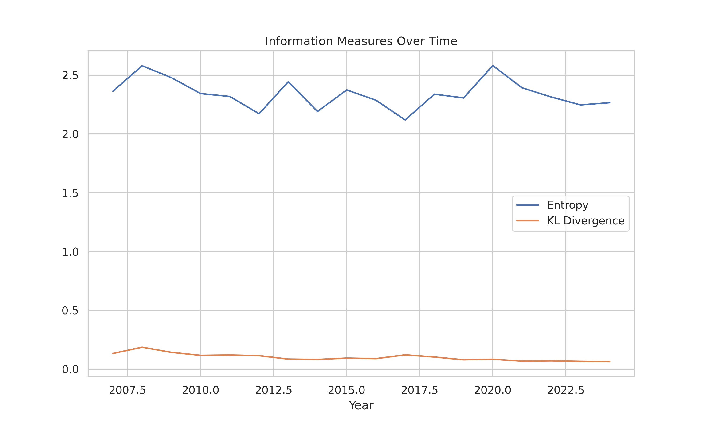
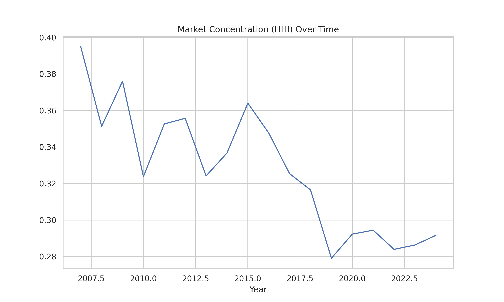
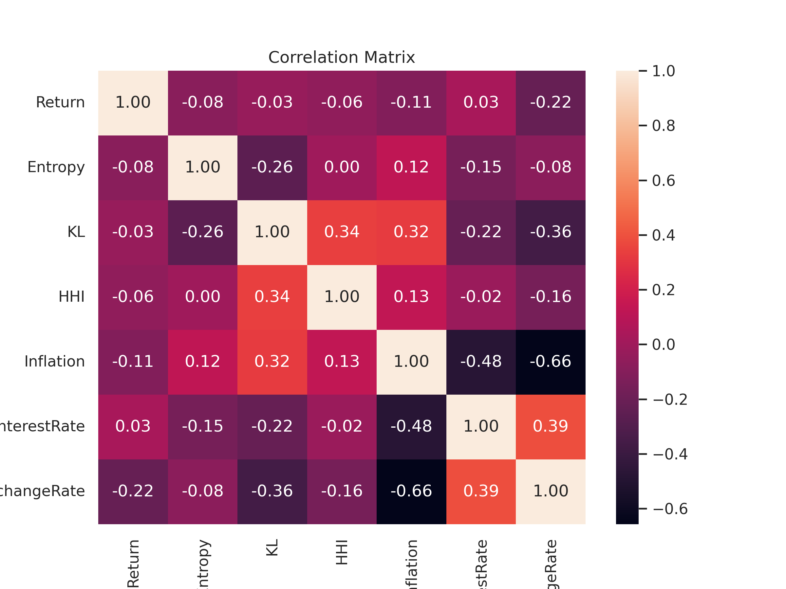
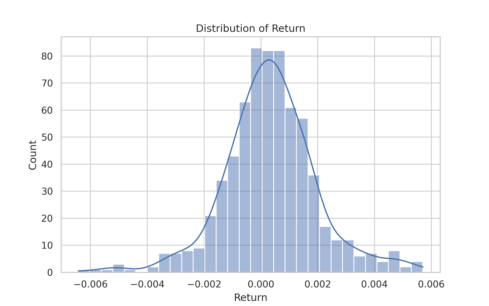
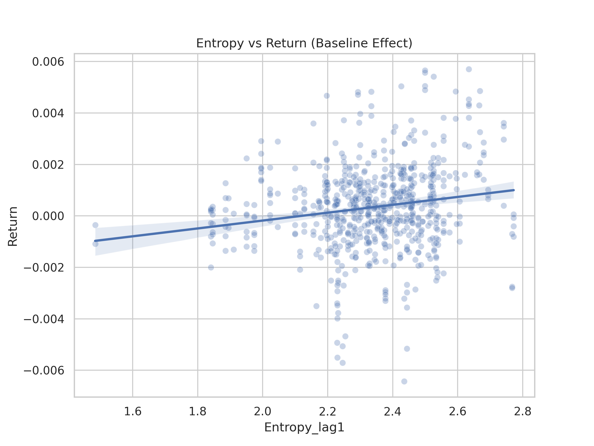
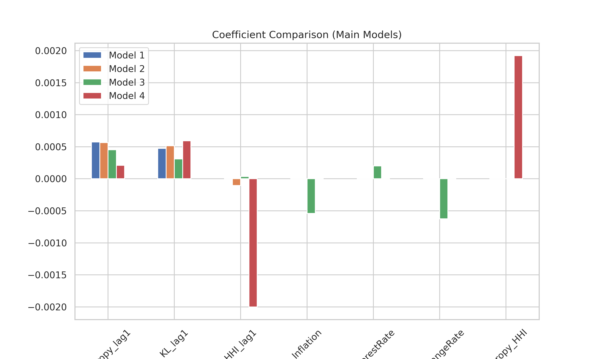
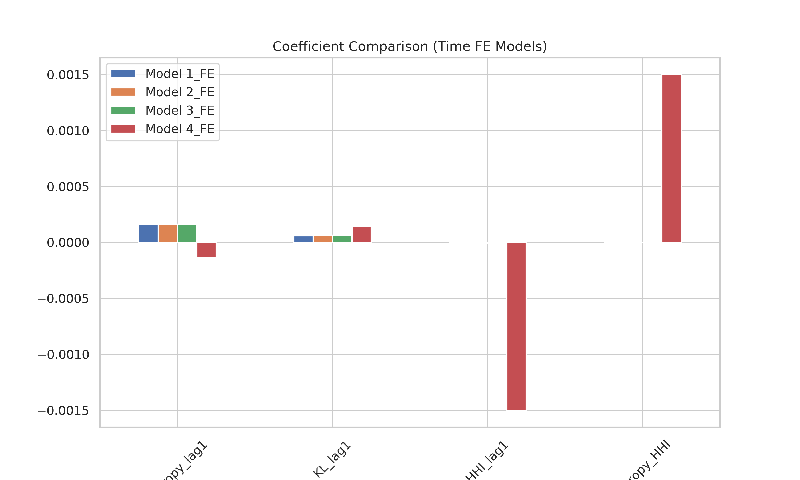
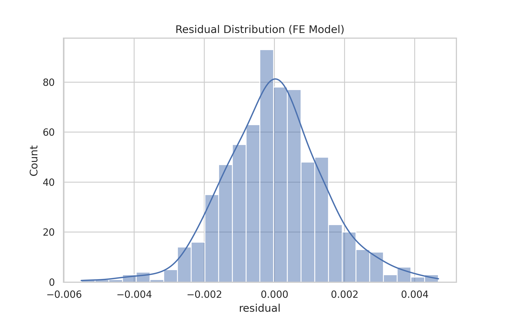

# Entropy, Market Structure, and Stock Returns  
### A Panel Data Analysis of Informational Complexity in Emerging Markets

---

## Overview

This repository presents a **panel econometric study** examining how **informational complexity (Entropy, KL divergence)** and **market concentration (HHI)** jointly influence stock returns.

The study integrates:
- Information Theory  
- Industrial Organization  
- Panel Econometrics  

using a **multi-model fixed effects framework**.

---

## Key Contributions

- Introduces **entropy and KL divergence** as predictors of financial returns  
- Demonstrates **nonlinear interaction effects** between information and market structure  
- Provides **robustness validation** using two-way fixed effects  
- Combines **micro-level firm data with macroeconomic variables**

---

## Repository Structure

data/ → Final panel dataset
figures/ → All research visuals (publication-ready)
results/ → Regression outputs (CSV tables)
notebooks/ → (Colab / analysis notebooks)

---

## Key Results

### Main Regression Results (No Time Fixed Effects)

| Variable        | Model 1 | Model 2 | Model 3 | Model 4 |
|----------------|--------|--------|--------|--------|
| Entropy_lag1   | 0.0006 | 0.0006 | 0.0005 | 0.0002 |
| KL_lag1        | 0.0005 | 0.0005 | 0.0003 | 0.0006 |
| HHI_lag1       | —      | -0.0001| 0.0000 | -0.0020 |
| Exchange Rate  | —      | —      | -0.0006 | —      |
| Entropy × HHI  | —      | —      | —      | 0.0019 |

📌 **Insight:**  
- Informational variables are significant in baseline models  
- Effects weaken with macro controls  
- Interaction term reveals **nonlinear structure**

---

## Key Visualizations

### 1. Time-Series Dynamics

Shows co-movement between entropy and KL over time, capturing **information regime shifts**

---

### 2. Market Structure Trend (HHI)

Indicates relatively stable but **sector-dependent concentration patterns**

---

### 3. Correlation Structure

Confirms **low multicollinearity**, supporting regression validity

---

### 4. Distribution of Returns

Reveals **fat tails**, justifying use of KL divergence

---

### 5. Interaction Effect (Core Finding)

Demonstrates that:
> The impact of entropy on returns **depends on market concentration**

---

### 6. Model Coefficients (Main Models)

Visual comparison of coefficient stability across specifications

---

### 7. Fixed Effects Robustness

Shows attenuation of effects under **time fixed effects**

---

### 8. Residual Diagnostics

Residuals are approximately centered → model is well-behaved

---

## Methodology

### Model Specification

\[
R_{i,t} = lpha + eta_1 Entropy_{t-1} + eta_2 KL_{t-1} + eta_3 HHI_{t-1} + \gamma X_t + \mu_i + \epsilon_{i,t}
\]

### Interaction Model

\[
Entropy\_HHI = Entropy_{t-1} 	imes HHI_{t-1}
\]

### Estimation

- Fixed Effects (FE)
- Clustered standard errors (entity + time)
- Hausman test for model selection
- VIF for multicollinearity diagnostics

---

## Data

- Source: **Yahoo Finance + World Bank**
- Period: **2005–2026**
- Firms: **40**
- Observations: **674**
- Sectors: Banking, Energy, Telecom, etc.

---

## Reproducibility

You can run the full analysis using Google Colab:

1. Upload notebook to `/notebooks/`
2. Load dataset from `/data/`
3. Run all cells → results + figures will be reproduced

---

## Results Files

- `results/coeff_main.csv` → Main regression results  
- `results/coeff_fe.csv` → Fixed effects robustness  

---

## Key Takeaways

- Information complexity predicts returns — but conditionally  
- Market concentration moderates informational value  
- Macroeconomic factors absorb large variation  
- Nonlinear interaction effects are the most robust finding  

---

## License

MIT License

---

## Author

**Zia Ul Rehman Zafar**  
Research in Financial Econometrics & Machine Learning

---

## Citation

If you use this work, please cite:

ZUR ZAFAR (2026). Entropy, Market Structure, and Stock Returns:
A Panel Data Approach.

---